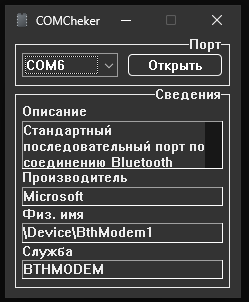
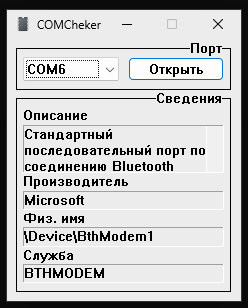
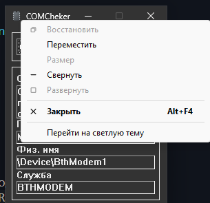
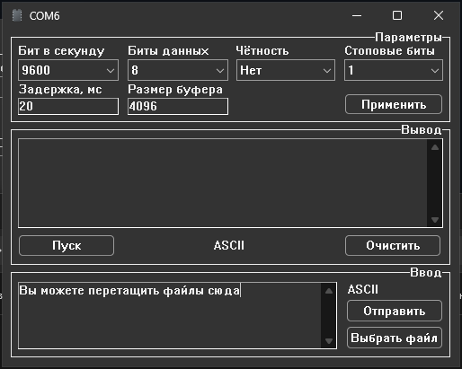
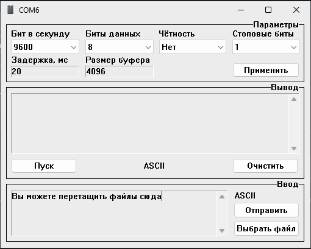

# COMChecker2
COMChecker2.0, обновление кода и рефакторинг  
# Описание
- Полностью поддерживает функционал оригинала
- Исправлены проблемы с безопасностью и надежностью, повышена безопасность при работе с потоками
- Добавлен бесконечный скроллинг вывода путем удаления начала при переполнении в EDIT
- Добавлены параметры задержки(ожидания между отправками пакетов) и буфера памяти(набирается чтением с порта до конца задержки или переполнения)
- Добавлено автомасштабирование формы чтения с порта
- Drag&drop файлов в поле ввода
- Отправка данных на порт по ctrl+enter
- Переключение темы(светлая/темная, по умолчанию используется как в системе)
- Выбор форматов ввода и вывода(ASCII/HEX, для HEX пробел допустим как разделитель)  

# Скриншоты

	<figure>
		<figcaption>Стартовая форма(темная тема)</figcaption>
		
	</figure>
	<figure>
		<figcaption>Стартовая форма(светлая тема)</figcaption>
		
	</figure> 

 

<figure>
	<figcaption>Смена темы</figcaption>
	
</figure>  

	<figure>
		<figcaption>Форма порта(темная тема)</figcaption>
		
	</figure>
	<figure>
		<figcaption>Форма порта(светлая тема)</figcaption>
		
	</figure> 

 

# Компиляция из исходников
Для компиляции сначала клонируйте репозиторий с подмодулями  
`git clone --recurse-submodules https://github.com/ZReticules/COMChecker2`  
Затем в командной строке используя FASM со всеми пакетами макросов по умолчанию  
`fasm -m 999999 COMChecker2.fasm COMChecker2.exe`  
Для выбора архитектуры x86 в файле COMChecker2.fasm замените  
`include "FASM_OOP\x64.inc"`  
на  
`include "FASM_OOP\x86.inc"` 
